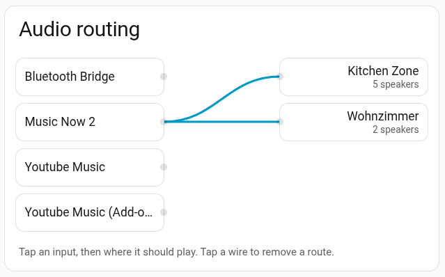
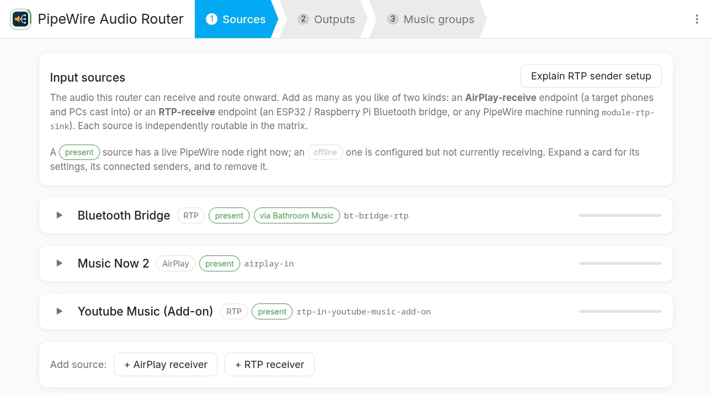
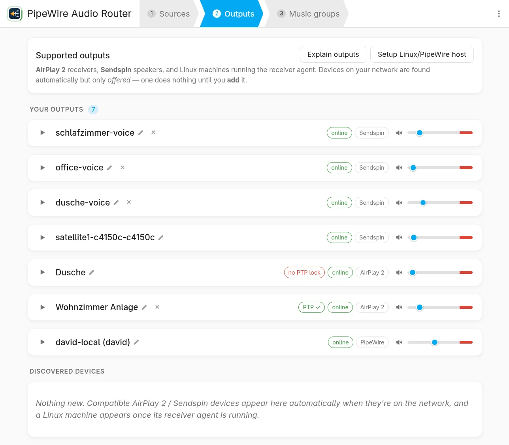
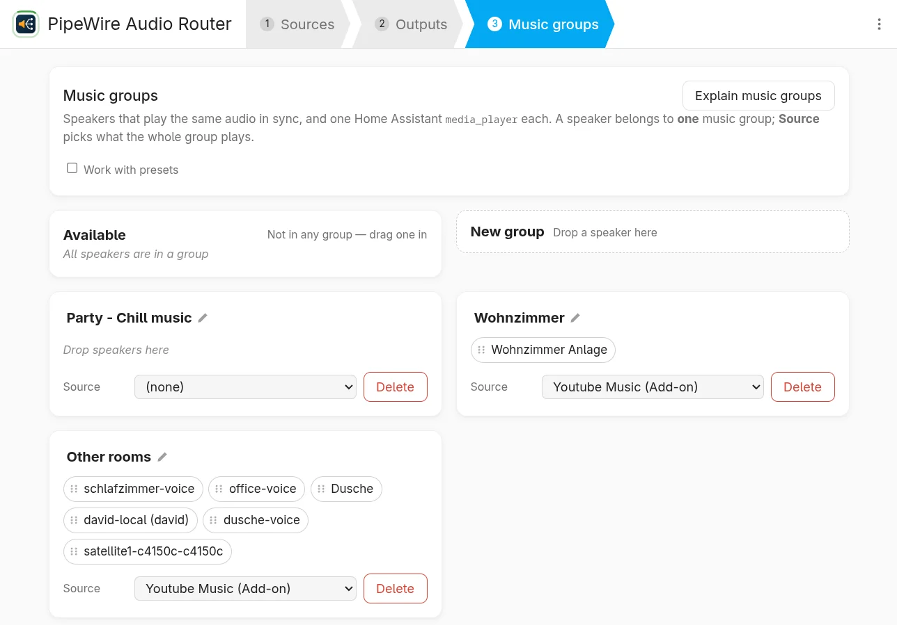
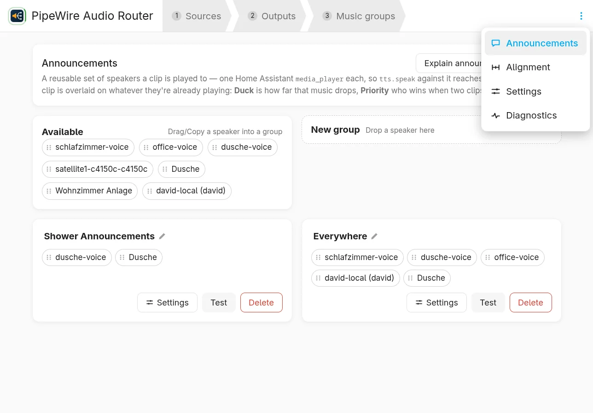
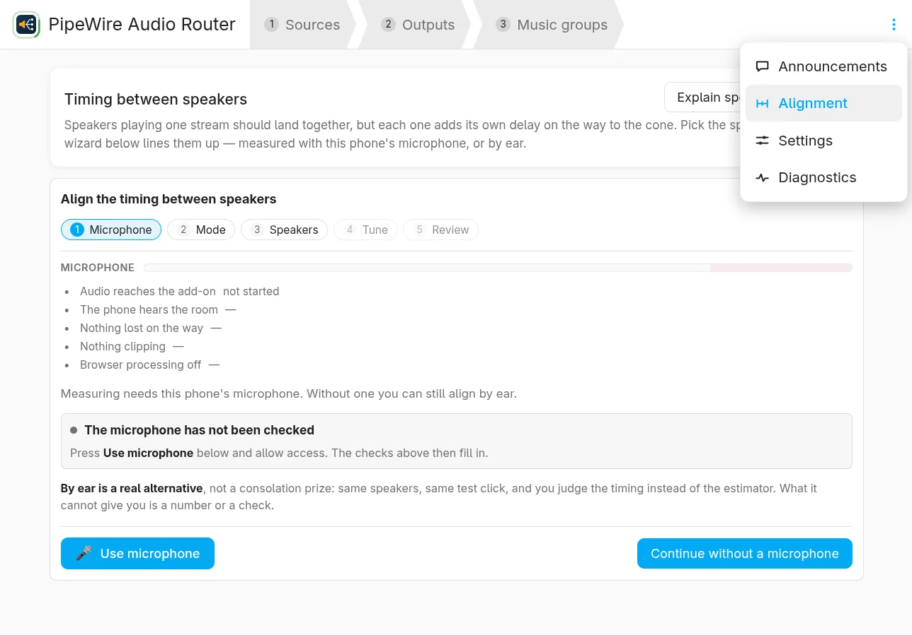
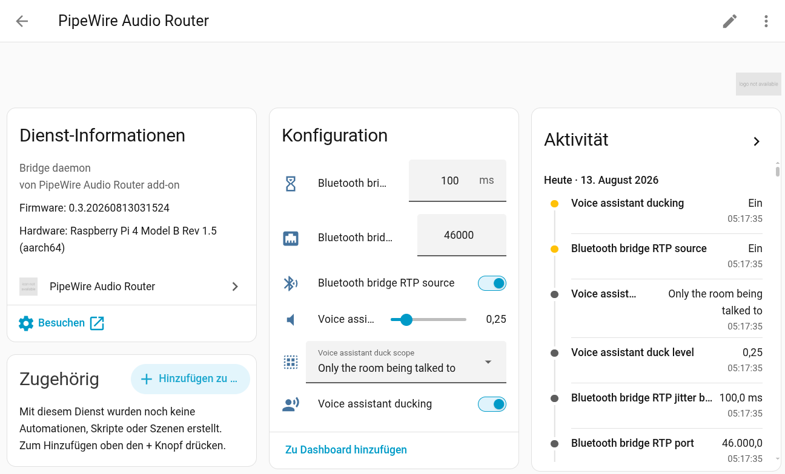
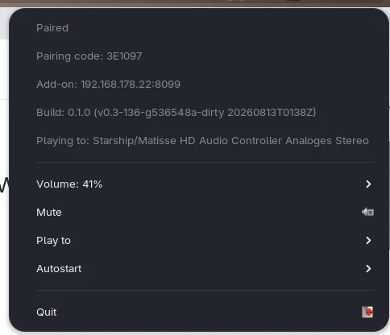
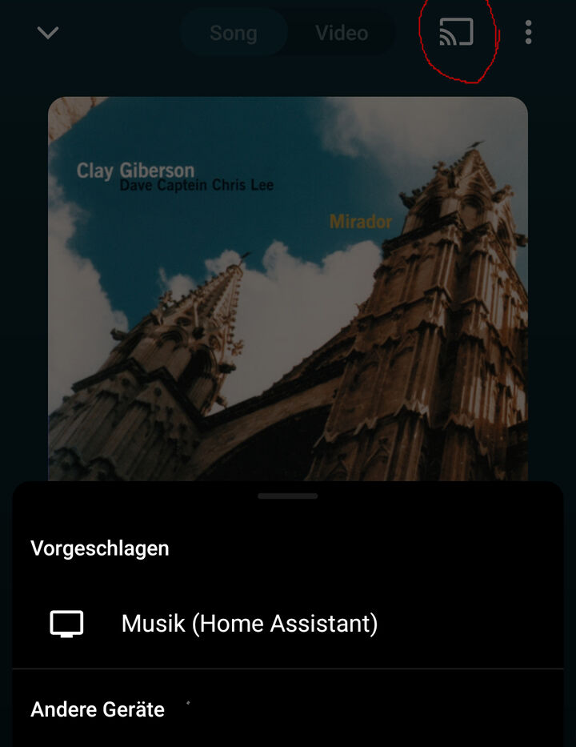

[](https://github.com/davidgraeff/homeassistant-audio-routing/actions/workflows/ci.yml)

**Whole-home audio for Home Assistant, without the stutter.** Play from your
phone, your PC or any Bluetooth device, send it to any speakers in the house
from one dashboard card, and let Home Assistant talk over the top of it —
ducked, not interrupted.

Under the hood the audio path is PipeWire's own realtime graph, driven by a
small Rust daemon. Mixing and re-clocking several streams for several rooms is
a realtime-scheduling problem: on a Raspberry Pi 4 a Python engine doing that
job stuttered audibly and took seconds to start a stream, while PipeWire's
graph is a C daemon built for precisely it. This sits *under* a music library
rather than in place of one — see
[Works with Music Assistant](#works-with-music-assistant).


<table>
  <tr valign="top">
    <td width="50%" align="left">
      <picture>
        <source media="(prefers-color-scheme: dark)" srcset="docs/diagrams/audio-flow-dark.svg">
        
      </picture>
      <br><sub><b>Audio flows left to right</b>: The music dips when Home Assistant speaks, then comes
back.</sub>
    </td>
    <td width="50%" align="left">
      <a href="docs/images/audio_routing_card.webp"></a>
      <br><sub><b>The audio routing dashboard card</b> inputs on the left, zones on the right, live routes drawn as wires between them.</sub>
      <br><sub>
Tap an input, then where it should play. Tap a wire to remove a route. Speakers
fed by the same inputs are synchronised into one group for you, so "play this
in the kitchen and the living room" is two taps and stays in sync.
</sub>
    </td>
  </tr>
</table>

## What you get

- **Play in from** an iPhone, Mac or PC over AirPlay · any Bluetooth device, via
  a small ESP32 or Raspberry Pi bridge box · a Linux PC, via a receiver agent ·
  the YouTube Music app's own Cast button, via a second add-on in this
  repository.
- **Play out to** AirPlay-2 receivers, AV receivers and HomePods · ESPHome
  speakers such as Home Assistant Voice PE · any Linux PC running the agent.
- **Ordinary Home Assistant entities**: a `media_player` per output plus one per
  group, with volume, and routing you can drive from automations and scripts —
  not just from the card.
- **Announcements that duck**, per room: TTS plays over the music at full
  clarity, the music dips and comes back, and a PC's own audio (a browser, a
  game) dips with it.
- **Discovery you stay in charge of.** Every compatible device on the LAN is
  *offered*, including the neighbours' AirPlay speakers; nothing is routable,
  gets an entity, or is ever sent audio until you add it — each with a
  test-tone button so you can tell which speaker is which.

## A look around

The add-on's own web UI, in Home Assistant's sidebar — and the device it adds to
Home Assistant itself. Click any shot for full size.

<table>
  <tr valign="top">
    <td width="33%" align="center">
      <a href="docs/images/screen_sources.webp"></a>
      <br><sub><b>Sources</b> — every input you can route: AirPlay endpoints phones and PCs cast into, RTP from a Bluetooth bridge or a PipeWire machine. Add as many as you like.</sub>
    </td>
    <td width="33%" align="center">
      <a href="docs/images/screen_outputs.webp"></a>
      <br><sub><b>Outputs</b> — what you added, with its protocol, whether it is online, its PTP lock, and its own volume. Discovered devices are only <i>offered</i> until you add them.</sub>
    </td>
    <td width="33%" align="center">
      <a href="docs/images/screen_music_groups.webp"></a>
      <br><sub><b>Music groups</b> — speakers that play the same audio in sync, one Home Assistant <code>media_player</code> each. <b>Source</b> picks what the whole group plays.</sub>
    </td>
  </tr>
  <tr valign="top">
    <td width="33%" align="center">
      <a href="docs/images/screen_announcements.webp"></a>
      <br><sub><b>Announcements</b> — a reusable set of speakers a clip is played to. <b>Duck</b> is how far the music drops, <b>Priority</b> who wins when two clips collide.</sub>
    </td>
    <td width="33%" align="center">
      <a href="docs/images/screen_alignment.webp"></a>
      <br><sub><b>Alignment</b> — speakers on one stream should land together, but each adds its own delay. The wizard lines them up, measured with your phone's microphone or by ear.</sub>
    </td>
    <td width="33%" align="center">
      <a href="docs/images/screen_ha_device.webp"></a>
      <br><sub><b>In Home Assistant</b> — the add-on's own device: voice-assistant ducking, the Bluetooth-bridge source, and which build is running on what hardware.</sub>
    </td>
  </tr>
</table>

## Works with Music Assistant

[Music Assistant](https://music-assistant.io/) answers *what* to play; this
answers *where* it goes and when it has to be exact. Point MA at this add-on's
AirPlay input and it becomes one more AirPlay player in its list: MA keeps the
library and the queue, and the audio it sends is routed, grouped and ducked here
like anything else that streams in.

| | Music Assistant | this project |
|---|---|---|
| Knows about | libraries, playlists, web radio, providers, queues, artwork | PipeWire nodes, AirPlay/RTP/sendspin transports, clocks |
| Multiroom | in sync within one ecosystem; across ecosystems, unsynced | in sync across protocols |
| Routing | a queue to its player | any input to any set of outputs, live |
| Latency | not a design driver | the design driver |

Playlists, queues, gapless and library browsing are deliberately not built here
— that is MA's job. Setup and troubleshooting:
[docs/music_assistant_compatibility.md](docs/music_assistant_compatibility.md).

## Quick install

### 1. The add-on — required

This is the piece that moves the audio. Add the repository, then install
**PipeWire Audio Router** from the store and start it. There are no options to
fill in: outputs and sources are added at runtime in its own web UI.

[](https://my.home-assistant.io/redirect/supervisor_add_addon_repository/?repository_url=https%3A%2F%2Fgithub.com%2Fdavidgraeff%2Fhomeassistant-audio-routing)

### 2. The integration — recommended

This is what turns the add-on's outputs into `media_player` entities and brings
the routing card to your dashboard. Download it with HACS:

[](https://my.home-assistant.io/redirect/hacs_repository/?owner=davidgraeff&repository=homeassistant-audio-routing&category=integration)

If HACS does not open the repository, add it by hand first — HACS → ⋮ →
**Custom repositories** → this repo's URL, category **Integration**. Without
HACS, copy [`custom_components/pipewire_audio_router/`](custom_components/pipewire_audio_router/)
into your config's `custom_components/`.

Then restart Home Assistant and go to Settings → Devices & Services → **Add
integration** → *PipeWire Audio Router*, and give it the add-on's host and port
(default `8099`). Setup calls the add-on to check it is reachable, so a typo
fails loudly instead of silently.

### 3. A Bluetooth bridge box — optional

Turns any phone, tablet or laptop that can pair over Bluetooth into a source.
Flash [`firmware/bt-bridge/`](firmware/bt-bridge/README.md) onto an
original-ESP32 board (not S2/S3/C3/C6 — that README explains why), or use
[`firmware/pi-bridge/`](firmware/pi-bridge/README.md) on a Raspberry Pi Zero 2 W
for higher-quality codecs.

### 4. A Linux PC as an output — optional

Turns any Linux machine running PipeWire — your desk PC, a media box, a Pi in
the workshop — into an output the router can stream to. Its master volume and
mute become Home Assistant's, and its *own* audio (a browser, a game) dips while
an announcement plays. That takes a small helper [`pwrouter-agent`](pipewire_audio_router/pwrouter-agent/README.md).

<a href="docs/images/pipewire_agent.webp"></a>

Get the binary for that machine's architecture (`uname -m`) either **from the
add-on** — *Outputs* → **Setup Linux/PipeWire host** or from this repository's
[**Releases**](https://github.com/davidgraeff/homeassistant-audio-routing/releases)
page. Then, on that machine:

```sh
chmod +x pwrouter-agent-*
# copies it to ~/.local/bin, writes the systemd user unit
./pwrouter-agent-* autostart enable    
systemctl --user start pwrouter-agent
```

### 5. YouTube Music's Cast button — optional

Puts the house in the Cast menu of the YouTube Music app. It is a second add-on
in the same repository, so it is already in your store from step 1 — install it,
start it, open its panel, and it walks you through the two things it needs: one
button to create its audio route on the router, and to setup your account.

It plays from **your signed-in account** and leans on unofficial protocols and
on `yt-dlp` keeping pace with YouTube, so treat it as the least stable thing
here. Details in [`ytmusic_receiver/`](ytmusic_receiver/README.md), reasoning and
every measured gotcha in
[docs/ytmusic-receiver.md](docs/ytmusic-receiver.md).

<a href="docs/images/ytmusic_share.jpg"></a>

<sub>What it buys you: the house in the app's own Cast menu.</sub>

## Status

**In daily use.**

Last tested against **Home Assistant 2026.8.1**.
Requires a **minimum of 2026.7.0** (`hacs.json`).

## Documentation

- [**docs/system-architecture.md**](docs/system-architecture.md) — how the
  pieces fit together, with diagrams.
- [**docs/decisions.md**](docs/decisions.md) — why it's built this way: real
  investigations with concrete findings (RAOP quirks, PipeWire's actual
  volume/module-loading capabilities, ESP32 hardware constraints, and more),
  not preferences.
- [**docs/music_assistant_compatibility.md**](docs/music_assistant_compatibility.md)
  — pointing Music Assistant at this add-on, who owns what, and what to do when
  it does not connect.
- [**docs/api-reference.md**](docs/api-reference.md) — the bridge daemon's
  REST/WebSocket API.
- [**docs/addon_maintenance.md**](docs/addon_maintenance.md) — keeping up with
  Home Assistant: which HA version the tests run against and how to bump it,
  what past bumps broke, and the commands for testing and deploying against
  the real instance.
- [**docs/ytmusic-receiver.md**](docs/ytmusic-receiver.md) — the YouTube Music
  Cast receiver.
- [**docs/branding/**](docs/branding/README.md) — the icon and logo, and how to
  re-render them.
- [**tests/**](tests/) — the runnable scripts backing those write-ups; nothing
  here is "verified" without one. All of it — the Rust daemon
  (rustfmt/clippy/tests), the web UI (svelte-check/build), the HA integration
  (pytest), and the add-on end-to-end scripts — runs in CI on every push to
  `main` and every PR
  ([`.github/workflows/ci.yml`](.github/workflows/ci.yml)). A `v*` tag also
  publishes the add-on images to GHCR
  ([`build-addon.yml`](.github/workflows/build-addon.yml)) and a GitHub release
  carrying the receiver-agent binaries for x86-64 and aarch64
  ([`release.yml`](.github/workflows/release.yml)).

## How it works

Phones, PCs and a Bluetooth bridge box stream in; a Rust daemon routes and
mixes them through a native PipeWire graph and out to AirPlay-2 receivers,
ESPHome speakers and PCs; Home Assistant sees ordinary `media_player` entities
at the far end.


## Components

Independently installable pieces, plus supporting dev tooling. Each has its own
README with install/config/usage details.

| Component | What | README |
|---|---|---|
| **Bridge daemon add-on** | Rust + PipeWire/WirePlumber, packaged as a real HA add-on (`repository.yaml` at repo root) | [`pipewire_audio_router/`](pipewire_audio_router/README.md) |
| **Home Assistant integration** | `media_player` entities backed by the add-on's REST API, plus the `custom:pipewire-router-card` dashboard card | [`custom_components/pipewire_audio_router/`](custom_components/pipewire_audio_router/README.md) |
| **Bluetooth bridge firmware** | ESP32 + ESPHome, turns any Bluetooth device into a whole-home-audio source | [`firmware/bt-bridge/`](firmware/bt-bridge/README.md) |
| **Raspberry Pi bridge** | the same job on a Pi Zero 2 W, for higher-quality Bluetooth codecs | [`firmware/pi-bridge/`](firmware/pi-bridge/README.md) |
| **pw-sink receiver agent** | makes a Linux PC an output the router can stream to, and duck | [`pipewire_audio_router/pwrouter-agent/`](pipewire_audio_router/pwrouter-agent/README.md) |
| **YouTube Music Cast receiver** | the YouTube Music app's Cast button, as a source — an add-on in this repo's store, with its own setup page | [`ytmusic_receiver/`](ytmusic_receiver/README.md) |

## Repo layout

```
pipewire_audio_router/                the HA add-on: bridge daemon (Rust) + Dockerfile + config.yaml
custom_components/pipewire_audio_router/   HA integration (Python)
firmware/bt-bridge/                   ESPHome firmware for the Bluetooth bridge box
firmware/pi-bridge/                   Raspberry Pi Bluetooth bridge
firmware/pi-ytmusic/                  Raspberry Pi YouTube Music receiver (canonical receiver app)
ytmusic_receiver/                     the same receiver as a local HA add-on
container/                            throwaway bare-PipeWire dev sandbox — not the real add-on
docs/                                 architecture, decisions, API reference, branding
tests/                                verification scripts
scripts/                              dev tooling (e.g. arm64 cross-build, branding render)
```
