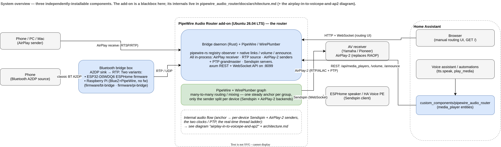
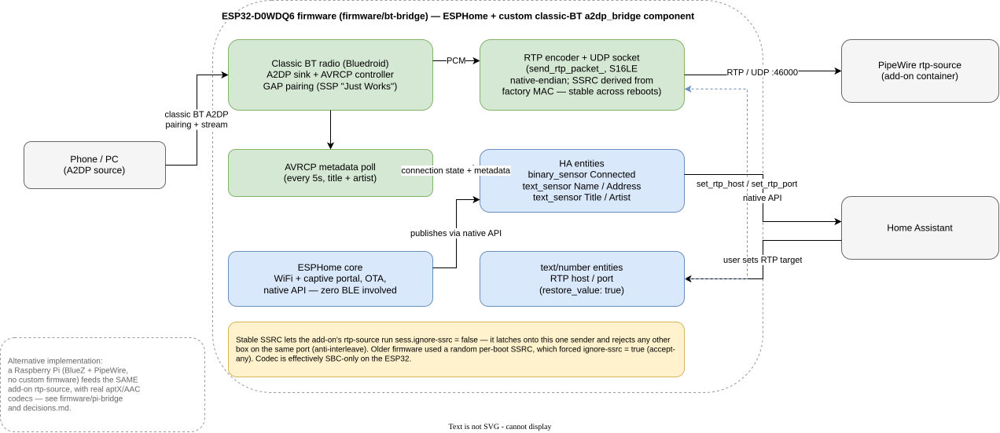

# Architecture

This project replaces Music Assistant's Python audio engine with a native
PipeWire graph for whole-home audio routing, controlled by a small Rust
daemon and exposed to Home Assistant as ordinary `media_player` entities.
The reasoning behind *why* it's built this way — the investigations,
dead ends, and hardware-specific findings — lives in
[decisions.md](decisions.md). This document describes the system as it
stands.

## System overview



Three independently-installable pieces:

| Component | What it is | Where |
|---|---|---|
| **Bridge daemon add-on** | Rust binary + PipeWire/WirePlumber, packaged as a Home Assistant add-on | [`pipewire_audio_router/`](../pipewire_audio_router/README.md) |
| **Home Assistant integration** | Python `custom_components/` integration exposing `media_player` entities backed by the add-on's REST API | [`custom_components/pipewire_audio_router/`](../custom_components/pipewire_audio_router/README.md) |
| **Bluetooth bridge firmware** | ESPHome firmware turning an ESP32 into a Bluetooth-speaker-like A2DP sink that feeds audio into the router via RTP | [`firmware/bt-bridge/`](../firmware/bt-bridge/README.md) |

None of these three depend on each other at build time — the add-on runs
standalone (with its own manual routing web UI), the HA integration just
needs *some* reachable instance of the add-on's API, and the BT bridge
firmware just needs an RTP-source endpoint (normally the add-on, but any
PipeWire `rtp-source` would do).

## Audio flow

1. **Sources** feed PCM into the PipeWire graph running inside the add-on
   container:
   - Phones/PCs stream to it as an AirPlay receiver. This is a **native,
     in-process** RAOP receiver (a vendored+patched pure-Rust `shairplay`
     crate, `airplay_source.rs`) whose decoded PCM is pushed through a
     small jitter buffer into a PipeWire source node (`airplay-in`) —
     **not** a `shairport-sync` subprocess (which had no PipeWire backend
     in the Ubuntu build, so its audio never reached the graph). See
     [decisions.md](decisions.md#native-airplay-receive-source-vendored-shairplay-not-shairport-sync).
   - The Bluetooth bridge box (a real ESP32 acting as a classic-Bluetooth
     A2DP sink) RTP-encodes what it receives and sends it to the
     container's `rtp-source` node — see
     [bt-bridge-firmware.svg](diagrams/bt-bridge-firmware.svg) for that
     device's internal flow. The RTP source can bind a multicast group so
     several PipeWire hosts share one bridge stream.
2. **The PipeWire graph** is a plain many-to-many routing/mixing graph —
   any source node can be linked to any sink node, including multiple
   sinks at once (the "one AirPlay source → RAOP output + sendspin
   output simultaneously" scenario that motivated this project). Linking
   itself is just PipeWire doing what PipeWire always does; nothing
   project-specific happens at this layer beyond which nodes exist.
3. **Outputs** are two kinds of PipeWire sink:
   - **RAOP** (AirPlay-receiver AV receivers, e.g. Yamaha/Pioneer):
     handled entirely by PipeWire's own `libpipewire-module-raop-sink`,
     one module per device — hot-loaded into the bridge daemon's own
     PipeWire context at runtime so outputs can be added/removed without
     restarting PipeWire (see [decisions.md](decisions.md#loading-pipewire-modules-at-runtime)).
   - **Sendspin** (ESPHome speaker devices, e.g. HA Voice PE): devices are
     **auto-discovered** over mDNS (`sendspin_discovery.rs`) and appear as
     virtual routing outputs. Devices routed from the *same* set of sources
     are automatically formed into one **synchronized group**
     (`sendspin_group.rs`): a null-sink node captured natively by the
     daemon, feeding one embedded Sendspin server (`sendspin_server.rs`, on
     a vendored+patched `sendspin` crate) that dials exactly that group's
     devices over the Sendspin WebSocket — all in-process, no subprocess.
     Per-device volume is sent in-band over the protocol
     (`sendspin_volume.rs`), and online/offline is decided by the live
     connection plus a TCP liveness probe — mDNS is discovery-only
     (`sendspin_liveness.rs`), so a flapping mDNS record never tears down a
     live group. See
     [decisions.md](decisions.md#sendspin-auto-discovery-grouping-per-device-volume-and-connection-driven-liveness).
4. **The bridge daemon** (Rust) is the only thing that knows about HA,
   config files, or "what a room is." It observes the live PipeWire
   registry on a dedicated thread (PipeWire's core types aren't `Send`)
   and exposes that state — plus native mutation endpoints (links via
   `Core::create_object`/`Registry::destroy_global`, volume via the node's
   `Props` param, announce playback via a `pw::stream`; no subprocesses) —
   over a REST + WebSocket API. There are **no subprocesses left** — the
   AirPlay receiver, the Sendspin servers, and the RTP source all run
   natively in-process, so `run.sh` is just infrastructure + the daemon.
   Full endpoint reference: [api-reference.md](api-reference.md).
5. **Home Assistant** talks to that API through the `custom_components`
   integration, which creates one `media_player` entity per routing-matrix
   **output** — RAOP receivers *and* discovered sendspin devices alike. The
   entity set follows the matrix: an output that leaves it (a discovered
   device that's truly gone) has its entity removed; a configured-but-offline
   one stays `unavailable`; a `cleanup_entities` service purges any stale
   leftovers. Volume (per-device, including sendspin), `play_media`/announce
   (real `MediaPlayerEntityFeature.MEDIA_ANNOUNCE`, ducking the existing
   source rather than replacing it), source selection, and state all
   round-trip through the daemon's REST API — nothing talks to PipeWire
   directly except the daemon itself.
6. **The manual routing UI** (`GET /` on the daemon) is a separate,
   simpler way to do the same linking a human would otherwise do via
   `pw-link`/Helvum — a source × output matrix, live-updated over the
   same WebSocket mechanism the registry-observer thread already
   maintains.

## Bluetooth bridge box



This is a separate ESP32 device (confirmed: original `ESP32-D0WDQ6` —
the only current-generation-adjacent chip with classic Bluetooth
hardware at all) running ESPHome plus a custom `external_components`
package (`a2dp_bridge`) that ESPHome has no built-in equivalent for.
It's a normal ESPHome device otherwise — WiFi, OTA, HA native API — none
of which conflicts with owning the classic-BT radio, since ESPHome only
touches Bluetooth when `esp32_ble`-family components are present in
YAML, and this device's YAML deliberately never includes any of them.

The firmware pairs as an ordinary Bluetooth speaker (A2DP sink + AVRCP
controller), decodes the negotiated SBC stream internally (handled by
the ESP-IDF Bluedroid stack), and re-encodes the resulting PCM as plain
RTP/UDP packets aimed at a configurable host:port — normally the
add-on's `rtp-source` node, reusing that already-proven receiving path
rather than inventing a new transport (`sendspin-cpp` was investigated
and ruled out for this direction — see decisions.md). The RTP target is
runtime-configurable from Home Assistant (`text`/`number` entities with
`restore_value: true`), not just a compile-time secret.

## Directory map

```
PLAN.md                              historical planning document — see docs/ instead
docs/                                 architecture, decisions, API reference, roadmap (this directory)
container/                            throwaway bare-PipeWire dev sandbox (spike 1) — not the real add-on
pipewire_audio_router/                the real HA add-on: bridge daemon (Rust) + Dockerfile + config.yaml
custom_components/pipewire_audio_router/   HA integration (Python) — media_player entities
firmware/bt-bridge/                   ESPHome firmware for the Bluetooth bridge box
spikes/                               write-ups: what was tried, what broke, what the fix was
tests/                                verification scripts backing every spike/phase claim
scripts/                              dev tooling (e.g. arm64 cross-build)
```

## Where to go next

- **Why it's built this way** (Rust not Python, no MQTT, Ubuntu 26.04
  not Debian, per-node not per-link volume, ESP32 chip constraints,
  RAOP auth quirks, and more): [decisions.md](decisions.md)
- **Bridge daemon REST/WebSocket API reference**:
  [api-reference.md](api-reference.md)
- **What's done vs. remaining**: [roadmap.md](roadmap.md)
- **Empirical write-ups per experiment**: [`../spikes/`](../spikes/)
