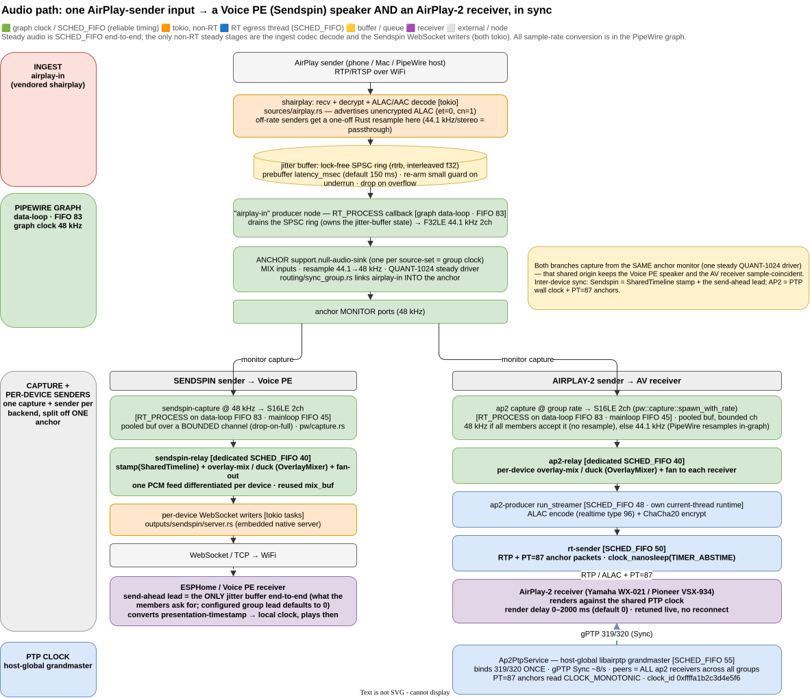

# Bridge daemon — architecture

The bridge daemon is the Rust binary at the heart of the PipeWire Audio
Router add-on. It runs PipeWire + WirePlumber inside the add-on container,
observes and mutates the live graph, and exposes everything as a REST +
WebSocket API. This document describes how it is put together *in detail*;
the system-wide, three-component picture (add-on + HA integration + BT
bridge firmware) lives one level up in
[`../../docs/system-architecture.md`](../../docs/system-architecture.md),
and *why* each piece is built this way lives in
[decisions.md](decisions.md). What is done vs. still planned is in
[airplay2-roadmap.md](airplay2-roadmap.md); how to poke a running instance
is in [live-instance-debugging.md](live-instance-debugging.md).

---

## 1. Process shape

The daemon is a single compiled binary. `run.sh` starts only
infrastructure — a private D-Bus session bus, PipeWire, WirePlumber — and
then the daemon; there are **no supervised subprocesses** (the AirPlay
receiver, the Sendspin servers and the RTP source all run natively
in-process, so `supervisor.rs` was removed — see
[decisions.md](decisions.md#source--sendspin-processes-are-daemon-supervised-not-spawned-by-runsh)).

Threading model, top to bottom:

- **The PipeWire thread.** PipeWire's core types aren't `Send`, so all
  graph work (registry listening *and* mutation) happens on one dedicated
  thread. Other threads talk to it over a `pipewire::channel` command
  channel (`pw_thread.rs`): `Load`/`Unload` a module, `CreateSinkNode`/
  `DestroySinkNode`, `CreateLinks`/destroy a link. Registry events flow
  back out to the rest of the daemon.
- **The tokio async runtime.** The axum REST/WS server, mDNS discovery,
  liveness probes, HTTP fetches and all control-plane logic. Capped to
  `worker_threads(2)` / `max_blocking_threads(4)` in `main.rs` — safe
  because **no time-critical audio work runs on tokio** (see the RT
  section below). *Caveat:* vendored crates spawn their own runtimes, so
  the observed `tokio-rt-worker` count is higher than 2.
- **SCHED_FIFO real-time threads.** Every stage that touches steady audio
  runs at a fixed real-time priority so that general-purpose tokio work,
  mDNS, or host load can never preempt it. See §6.

## 2. The PipeWire graph

The graph is a plain many-to-many routing/mixing graph: any source node
can be linked to any sink node, including several sinks at once (the
"one AirPlay source → RAOP receiver **and** Voice PE speaker
simultaneously" scenario that motivated the project). Nothing
project-specific happens at the link layer — PipeWire does what PipeWire
always does; the daemon only decides which nodes exist and which links to
create.

Link mutation is native `pipewire-rs` (`Core::create_object` with the
`link-factory`; `Registry::destroy_global` by id), not a `pw-link`
subprocess — 0.07 ms vs ~16 ms per round trip. Idempotency and targeted
unlink are decided against the observed registry state, not by parsing
subprocess stderr. See
[decisions.md](decisions.md#link-mutation-is-native-pipewire-rs-not-a-pw-link-subprocess).

## 3. Sources (audio into the graph)

| Source | Node | How it gets into the graph |
|---|---|---|
| **AirPlay receive** | `airplay-in` | Native, in-process RAOP receiver — vendored+patched pure-Rust `shairplay` crate (`airplay_source.rs`). Decoded f32 PCM is pushed through a jitter buffer into a PipeWire producer node. |
| **RTP** | `bt-bridge-rtp` (or similar) | PipeWire's `rtp-source` module, fed by the ESP32 / Pi Bluetooth bridge over RTP/UDP. Can bind a multicast group so several PipeWire hosts share one bridge stream. |

The AirPlay path is the interesting one for the AP2 flow below:

1. **AirPlay sender** (phone / Mac / another PipeWire host) streams
   RTP/RTSP over WiFi.
2. **`shairplay`** receives UDP/TCP, decrypts, and decodes ALAC (pure
   Rust) or AAC (`symphonia`) on a tokio worker — this codec work is
   irreducible and stays in Rust.
3. A **lock-free SPSC jitter-buffer ring** (`rtrb`, interleaved f32) rides
   out clock drift/jitter between the sender and the graph: prebuffer
   `latency_msec` (default 150 ms), re-arm to a small guard after an
   underrun, drop-on-overflow. (The `Mutex` around the producer only
   serializes session teardown/replacement — the RT consumer is lock-free.
   This replaced the old `Mutex<VecDeque>`.)
4. The **`airplay-in` node's `RT_PROCESS` callback drains the ring** on the
   graph **data-loop (SCHED_FIFO 83)** and emits **F32LE 44.1 kHz stereo**.
   The `airplay-producer` OS thread that hosts the stream's mainloop is
   itself elevated to **SCHED_FIFO 45** to protect the control path (see §6).

The receiver advertises **unencrypted ALAC** (`et=0`, `cn=1`) — the one
combination a PipeWire sender drives correctly on a trusted LAN. See
[decisions.md](decisions.md#native-airplay-receive-source-vendored-shairplay-not-shairport-sync).

## 4. The anchor + per-device sender model

This is the core routing pattern, and it is **shared by both output
backends** (Sendspin and AirPlay-2). It was validated on hardware by the
Sendspin overhaul and AP2 was aligned onto it.

- **One steady PCM source per group** = the group's
  `support.null-audio-sink` **anchor** (`sync_group.rs`, keyed
  `sync-grp-<hash>` by source-set). It is a **QUANT-1024 steady clock
  driver** and does the graph-native mix + resample. A *standalone
  per-device* null-sink is **not** a steady driver — it produced ~1 glitch
  / 60 s (QUANT-0 dropouts) — so every group member is fed from the *one*
  anchor monitor. Do **not** give each device its own sink.
- **One capture from `anchor.monitor` per backend group** (`sendspin_capture.rs`,
  a graph-clock-paced `RT_PROCESS` stream) produces **S16LE** at the group's
  wire rate — Sendspin at **48 kHz** (`spawn`), AP2 at its **negotiated rate**
  (`spawn_with_rate`: 48 kHz when every member accepts it, else 44.1 kHz with
  PipeWire resampling 48→44.1 in-graph — see §8). Capture hands out a pooled
  buffer (`PooledBuf`) over a **bounded** channel with non-blocking
  drop-on-full, so a stalled consumer can't grow memory/latency without bound.
- **One `SharedTimeline`** (`vendor/sendspin/src/server/timeline.rs`,
  `CLOCK_MONOTONIC_RAW`) stamps the sample timestamp **once per chunk**, so
  every per-device sender in the group emits the identical `ts` and stays
  sample-coincident.
- **Split only the *sender* per device, not the sink.** This gives
  per-device addressability (volume, delay, duck/overlay) while keeping
  devices sample-coincident and fed from one steady driver.

**Two-tier grouping:** an **MG** (Music Group) is the routable unit — a
routing target is polymorphic (`output | MG | …`); an **AG**
(Announcement Group) is additive, priority-preempting, with per-device
duck/overlay (`announce_arbiter.rs` / `announce.rs`).

### The `OutputBackend` seam (target end-state)

Historically "output" was scattered node-name-prefix `if`s across
`routing.rs`, `api.rs`, `sync_group.rs`, `media_player.py`. The intended
convergence is a single trait so each backend stops touching five files
and "drop RAOP" becomes a clean delete:

```rust
trait OutputBackend {
    fn prefix(&self) -> &'static str;          // "ap2-dev-", "sendspin-dev-"
    fn kind(&self) -> &'static str;            // "airplay2" | "sendspin"
    fn devices(&self) -> Vec<OutputDevice>;
    fn make_sender(&self, device: &NodeName, timeline: Arc<SharedTimeline>) -> Box<dyn PerDeviceSender>;
    async fn set_volume(&self, device: &NodeName, vol: f32);
    async fn set_delay(&self, device: &NodeName, ms: u32);
    async fn overlay(&self, device: &NodeName, action: OverlayAction); // AG duck/announce
}
```

`sync_group.rs::reconcile` would iterate backends and, per group, create
one `PerDeviceSender` per member off the group's `Arc<SharedTimeline>` +
anchor capture. With RAOP gone there are exactly two impls —
`SendspinBackend`, `Ap2Backend` — and no follower-sink exceptions.

## 5. Outputs (audio out of the graph)

### 5.1 Sendspin (ESPHome speakers, e.g. HA Voice PE)

Devices are **auto-discovered** over mDNS (`sendspin_discovery.rs`) and
surfaced as virtual routing outputs `sendspin-dev-<slug>`. Devices routed
from the same source-set are formed into one synchronized group. Per
group:

- **`sendspin-relay`** [SCHED_FIFO 40]: consumes the capture channel,
  `timeline.stamp()` + **overlay-mix / duck** (`overlay_mixer.rs`) +
  fan-out. One PCM feed is differentiated per device *inside the Rust
  process*. Uses a reused `mix_buf` (no per-chunk `Vec`).
- **Per-device WebSocket writers** [tokio tasks] push
  `stream_start`/audio to each device over the Sendspin WebSocket via an
  embedded native server (`sendspin_server.rs`, vendored+patched
  `sendspin` crate).
- **ESPHome / Voice PE receiver**: a **250 ms send-ahead lead** is the
  *only* jitter buffer end-to-end — it converts the presentation timestamp
  to its local clock and plays. Every hiccup above that 250 ms budget is
  audible.

Per-device **volume** is sent in-band over the protocol
(`sendspin_volume.rs`); **liveness** is connection-driven (mDNS is
discovery-only, `sendspin_liveness.rs`). See
[decisions.md](decisions.md#sendspin-auto-discovery-grouping-per-device-volume-and-connection-driven-liveness).

### 5.2 AirPlay-2 (AV receivers, e.g. Yamaha WX-021, Pioneer VSX-934)

The AP2 backend replaces the old RAOP/AirPlay-1 output. It is an
**in-process Rust AP2 sender** — vendored `lmcgartland/airplay2-rs`
(pairing / SETUP / RTP / streaming) driven by a **host-global PTP
grandmaster** from OwnTone's MIT `libairptp` via FFI. Devices are
discovered over `_airplay._tcp` (`ap2_discovery.rs`) and surfaced as
`ap2-dev-<slug>`. Per receiver, off the same anchor monitor:

- **`ap2-relay`** [SCHED_FIFO 40]: capture-forward loop. Each sender's feed
  is tagged with its `node_name`, so per chunk the relay calls
  `OverlayMixer::mix_into(node_name, …)` — a device with an active AG
  announcement gets duck(music)+overlay, its groupmates get plain music
  (symmetric with the Sendspin relay; the overlay clip is pre-matched to the
  group's rate — see §8). Reuses one `mix_buf` across chunks and devices.
- **`ap2-producer`** (`run_streamer`, vendored `streamer.rs`) [SCHED_FIFO
  48, own current-thread runtime]: **ALAC encode** (realtime type 96, cookie
  rate-matched to the group) + **ChaCha20 encrypt**.
- **`rt-sender`** [SCHED_FIFO 50]: emits **RTP** + **PT=87 anchor**
  packets, paced by `clock_nanosleep(TIMER_ABSTIME)`.
- **AP2 receiver**: renders against the shared PTP clock. A **render
  delay** (default 1500 ms, tunable 200–2000 ms via
  `AP2_RENDER_DELAY_MIN_MS..=MAX_MS`) is the receiver-side buffer. It is
  retuned **live** — `ap2_control` sends `SetRenderDelay` to the running
  streamer, which shifts the next PT=87 anchor — so a UI change takes
  effect mid-stream with **no reconnect**; it is deliberately *not* part of
  the group's restart identity. See
  [decisions.md](decisions.md#render-delay-is-retuned-live-not-by-reconnect).

**Restart identity + reliability.** The AP2 senders for a group are torn
down and rebuilt only when the **receiver set** or the **wire rate** (§8)
changes — never for a render-delay edit. `ap2_liveness.rs` TCP-probes each
receiver's RTSP port (3 failed ticks ⇒ demote; 5 min ⇒ remove + release its
PTP peer); the reconcile loop coalesces change bursts behind a 400 ms quiet
window; and `connect_one` retries once after ~1.5 s on a pairing failure
(receiver hadn't released the prior session).

**Alignment.** An AP2 group is alignable on the Align page (`calibrate.rs`):
members are muted/soloed via `ap2_control` (device-authoritative mute) and
each one's offset is tuned by ear with its **live render delay** — there is
no node-volume path (AP2 outputs are virtual).

## 6. The two clocks, cleanly separated

AP2 needs *two* independent clocks, and conflating them is the classic
mistake:

| Concern | Owner | Notes |
|---|---|---|
| **RTP sample timestamp** (`ts`; who-plays-which-sample) | `SharedTimeline` (target) / per-sender RTP counter (current impl) | Stamped once per chunk so every per-device sender in a group emits identical `ts` = sample-coincident. |
| **Network / PTP clock** (shared wall clock devices slave to) | **`libairptp`, host-global** (`ap2_ptp.rs`) | Binds 319/320 **once**; every AP2 receiver across all groups is a peer of the one grandmaster. PT=87 anchors are stamped from **`CLOCK_MONOTONIC`** (via `airptp_ffi::monotonic_ns()`) — *not* `CLOCK_MONOTONIC_RAW`, not epoch. |

**PTP is host-global; RTP/grouping is per-group.** One `Ap2PtpService`
for the whole daemon; which audio a receiver plays is decided by which
group's sender streams to it (mirrors OwnTone: one libairptp + per-session
streams). gPTP lock is **required** for rendering — PT=87 anchors alone
are insufficient — and matters most for multi-room drift.

> **Current-vs-target divergence.** Phase 3 as shipped uses independent
> per-device `Connection`s that share the grandmaster `clock_id` + the
> same PCM (matching the proven spike `test_group`), **not** the
> stamp-once `SharedTimeline` / `push_encoded` path. That is sufficient
> for sync (PTP + coincident PCM); aligning AP2 onto `SharedTimeline` +
> the `OutputBackend` seam is the intended end state.

## 7. Real-time thread ladder

The whole audio data path is SCHED_FIFO end-to-end so nothing normal-
priority (tokio, mDNS, HTTP, host load) can preempt steady audio. On the
4-core Pi, with the relay and sender both at SCHED_FIFO, CPU pinning is
not required (revisit only if a stall traces to CPU contention).

| Thread | Priority | Role |
|---|---|---|
| PipeWire `data-loop.N` | **FIFO 83** | The graph RT thread; mix/resample/capture `RT_PROCESS`. |
| `libairptp` | **FIFO 55** | gPTP event loop (Sync/Follow_Up 8×/s). Timer accuracy is what makes receivers lock; a starved SCHED_OTHER loop dilated the 125 ms timer ~48×. |
| `rt-sender` | **FIFO 50** | AP2 RTP egress, `clock_nanosleep` paced. |
| `ap2-producer` | **FIFO 48** | AP2 ALAC encode + encrypt (`run_streamer`, own current-thread runtime). |
| capture / producer feeder mainloops | **FIFO 45** | `sendspin_capture.rs` / `airplay_source.rs` PipeWire mainloops — low-impact for steady audio (that's on `data-loop`), protects the *control* path (reconnect/flush/stop) under load. |
| `ap2-relay`, `sendspin-relay` | **FIFO 40** | Capture→sender fan-out relays. |

`CAP_SYS_NICE` (`config.yaml` `privileged: [SYS_NICE]`) bypasses the
container's `RLIMIT_RTPRIO=0`, so these elevations succeed in-container;
they are best-effort/non-fatal without it (dev box).

## 8. Sample-rate harmonization

**All resampling happens at the PipeWire level — never in a Rust hot
path.** `sendspin_capture::spawn_with_rate` sets the capture stream's rate
and PipeWire does the SRC in-graph on its RT thread.

- **Internal bus (anchor + `SharedTimeline` + `OverlayMixer` + announce
  assets) = 48 kHz** (Sendspin's native rate and the overlay format).
- **Wire rates are per-group and negotiated (AP2).** PipeWire bridges the
  one 48 kHz anchor to each per-device capture: Sendspin @ 48 kHz (no
  conversion); AP2 @ its group rate — **48 kHz** when every member accepts it
  (then it's 48 kHz end-to-end, no resampling anywhere), else **44.1 kHz**
  with PipeWire doing 48→44.1 in-graph. No steady Rust resampling; don't
  unify the wire rates by hand.
- **AP2 rate negotiation (`sync_settings.rs`).** Each output has an
  `Ap2RateMode`: **`Auto`** (default) optimistically streams 48 kHz and, on a
  SETUP rejection (`ConnectFail { at_setup }`), learns a persisted per-device
  **44.1 kHz cap** so it doesn't re-probe; **`Fixed44100`** forces 44.1 for
  receivers known to dislike 48 kHz. Because one capture serves a whole group,
  `ap2_group_rate` = 48 kHz **iff every** member's effective rate is 48 kHz.
  The rate is part of the group's **restart identity**, so a change (UI mode
  switch or a learned downgrade) tears the senders down and reconnects once.
- **Announce asset — handled by the `OverlayMixer`.** Clips decode once to
  48 kHz stereo; the AP2 sender publishes its group's capture rate
  (`set_output_rate`), and `OverlayMixer::start` resamples the clip **once**
  to that rate (`resample::from_48k_stereo_to`, an **identity copy for 48 kHz**
  groups and Sendspin). So the per-chunk relay mix (`mix_into`) is pure
  sample-addition on the RT thread — the one-off resample is a Rust step, but
  not on the steady hot path.
- **Off-rate AirPlay senders** are the other exception: a sender that does
  not use 44.1 kHz/stereo gets a one-off linear resample in Rust at ingest
  (`airplay_source.rs`) before the ring. The common 44.1 kHz/stereo case is
  a zero-cost passthrough, and the steady 44.1↔48 kHz conversions are all
  in-graph — so no steady Rust resampling on the hot path.

## 9. Control plane → Home Assistant

The daemon exposes state + native mutation (links, per-node volume via
`Props`/`channelVolumes`, announce playback via a `pw::stream`) over
REST + WebSocket (`api.rs`; full list in
[`../../docs/api-reference.md`](../../docs/api-reference.md)). The Python
`custom_components` integration exposes a `media_player` per **music group**
and per **announcement group** (and, optionally, one per individual output).
`MediaPlayerEntityFeature.MEDIA_ANNOUNCE` (ducking, not replacing) lives on
the **announcement-group** entity — the intended announce/TTS target;
per-output entities carry `SELECT_SOURCE` + volume/mute only. Announce/duck
is URL- or Wyoming-based; audio is decoded with `symphonia` (no `ffmpeg`).
See
[decisions.md](decisions.md#ttsannounce-ducking-url-based-v1-and-wyoming-based-v2-additive).

---

## 10. End-to-end flow: AirPlay sender → Voice PE + AirPlay-2 receiver



One AirPlay input fanned to a Sendspin (Voice PE) speaker **and** an
AirPlay-2 AV receiver at the same time, in sync. Colour convention:
**green** = graph-clock / SCHED_FIFO (reliable timing), **orange** = tokio
(non-RT), **blue** = RT egress thread (SCHED_FIFO), **yellow** =
buffer/queue, **purple** = receiver. The ASCII sketch below is the same
flow in text.

```
                         ┌──────────────────────────────────────────────────────────┐
 INGEST (airplay-in)     │ AirPlay sender (phone / Mac / PipeWire host)               │
                         │        │  RTP/RTSP over WiFi                                │
                         │        ▼                                                    │
                         │ shairplay: recv + decrypt + ALAC/AAC decode  [tokio]        │  airplay_source.rs
                         │        ▼                                                    │
                         │ jitter buffer: lock-free SPSC ring (rtrb, 150 ms) [yellow]  │
                         └─────────────────────────────────────────────────────────┘
                                  ▼   (drained by the airplay-in RT_PROCESS callback)
 PIPEWIRE GRAPH          ┌──────────────────────────────────────────────────────────┐
 (data-loop, FIFO 83)    │ "airplay-in" producer node — RT_PROCESS drains ring        │
                         │   → F32LE 44.1 kHz   (mainloop thread FIFO 45)              │
                         │        ▼   (sync_group.rs links airplay-in INTO the anchor) │
                         │ ANCHOR support.null-audio-sink  (one per source-set)        │
                         │   · MIX inputs · resample 44.1→48 kHz · QUANT-1024 driver   │
                         │        ▼                                                    │
                         │ anchor MONITOR ports (48 kHz)                                │
                         └─────────────────────────────────────────────────────────┘
              ┌───────────────────┘        └───────────────────────────┐  (each backend captures the monitor)
              ▼  (SENDSPIN path → Voice PE)                             ▼  (AP2 path → AirPlay-2 receiver)
   ┌─────────────────────────────────────┐        ┌────────────────────────────────────────────┐
   │ sendspin-capture @ 48 kHz [FIFO 83/45]│        │ ap2 capture @ group rate [FIFO 83/45]         │
   │  pooled buf, bounded ch               │        │  48 kHz if accepted, else 44.1 (PW resamples) │
   │        ▼                              │        │        ▼                                      │
   │ sendspin-relay  [FIFO 40]             │        │ ap2-relay  [FIFO 40]                          │
   │  stamp(SharedTimeline)+overlay/duck   │        │  overlay/duck (OverlayMixer) + fan per receiver│
   │        ▼                              │        │        ▼                                      │
   │ per-device WS writers  [tokio]        │        │ ap2-producer run_streamer [FIFO 48]           │
   │        ▼                              │        │  ALAC(type 96) encode + ChaCha20 encrypt      │
   │ WebSocket / TCP → WiFi                │        │        ▼                                      │
   │        ▼                              │        │ rt-sender [FIFO 50]  RTP + PT=87 anchor        │
   │ ESPHome / Voice PE receiver           │        │  clock_nanosleep(TIMER_ABSTIME)               │
   │  250 ms send-ahead lead (only JB)     │        │        ▼                                      │
   └─────────────────────────────────────┘        │ AirPlay-2 receiver (Yamaha / Pioneer)         │
                                                    │  render delay 200–2000 ms (dflt 1500)         │
                                                    └────────────────────────────────────────────┘
                                                                    ▲
                                          gPTP 319/320 (Sync 8×/s)  │
   ┌────────────────────────────────────────────────────────────┐ │
   │ Ap2PtpService — host-global libairptp grandmaster [FIFO 55] │─┘  peers = ALL ap2 receivers
   │  clock_id 0xffff…; PT=87 anchors read CLOCK_MONOTONIC        │
   └────────────────────────────────────────────────────────────┘
```

**Key points for the diagram:**

- The two output branches share **one anchor monitor** (one steady
  QUANT-1024 driver) and each spawns its **own capture** off it — they
  diverge at the monitor. That shared origin is what keeps a Voice PE
  speaker and an AV receiver sample-coincident.
- **Inter-device sync differs per branch:** Sendspin uses the
  `SharedTimeline` stamp + the receiver's 250 ms lead (no PTP); AP2 uses
  the **PTP wall clock + PT=87 anchors** (its sample `ts` comes from a
  per-sender RTP counter, not the SharedTimeline — see the divergence note
  in §4/§6).
- **Sample rates:** 44.1 kHz at `airplay-in`, resampled to 48 kHz by the
  anchor (internal bus); the Sendspin capture is 48 kHz, the AP2 capture is
  its negotiated group rate — 48 kHz when every member accepts it (then
  end-to-end 48 kHz, no resample), else 44.1 kHz (PipeWire resamples in-graph).
  Steady rate conversion is all in the graph; the only Rust resamples are
  one-offs off the hot path (ingest fallback for non-44.1 kHz senders, and the
  announce clip matched to the group rate at overlay start — §8).
- **Everything on the steady path is SCHED_FIFO** — the ladder in §7. The
  only non-RT steady stages are the codec decode on ingest (tokio) and the
  per-device WebSocket writers (tokio, TCP-throttled).
